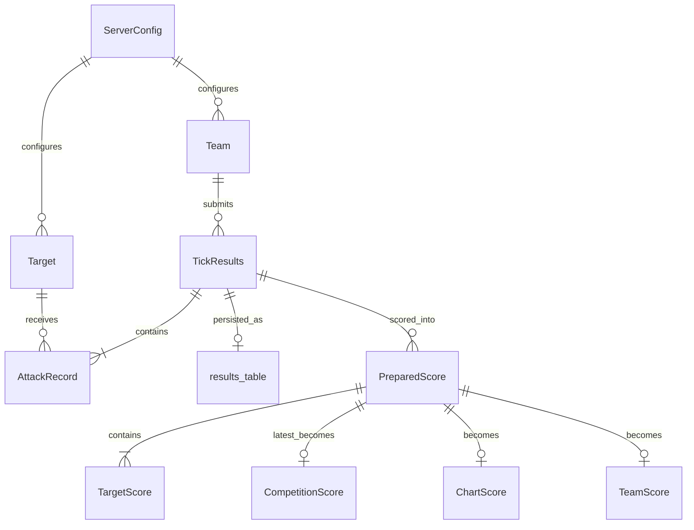

# Siege Scoreboard Data Model

Extracted from [0xd13a/siege](https://github.com/0xd13a/siege) — the defense competition framework's scoreboard server.

## Overview

The scoreboard ingests per-tick attack results from team bots, persists them, computes cumulative scores using a configurable scoring policy, and renders static HTML pages (leaderboard, per-team detail, and a D3 time-series chart).

```
Attack Bot ──POST /results/{team_id}──▶ Server ──queue──▶ Scoreboard
                                                              │
                                                              ├─▶ scoreboard.db (SQLite)
                                                              └─▶ HTML files (scoreboard.html, team{N}.html)
```

---

## Persistence

### Database: `scoreboard.db`

Location: `{base_folder}/data/scoreboard.db`

| Table     | Column    | Type            | Description                                                |
| --------- | --------- | --------------- | ---------------------------------------------------------- |
| `results` | `results` | `VARCHAR(2000)` | JSON-serialized `TickResults`, one row per tick submission |

Rows are appended on each new result (`INSERT`). On startup, all rows are loaded and replayed through `consume_result()`.

---

## Input: Tick Results (from attack bots)

Submitted via `POST /results/{team_id}` as JSON, validated against `result-schema.json`, and deserialized into `TickResults`.

### JSON Schema (`result-schema.json`)

```json
{
  "team_id": "integer",
  "tick": "integer",
  "results": {
    "<target_id>": [
      [<request_id>, <result_value>],
      ...
    ]
  }
}
```

- `results` keys are target (service) IDs as strings.
- Each inner array is exactly `[request_id, result_value]` (two integers).

### `TickResults`

| Field     | Type                            | Description                |
| --------- | ------------------------------- | -------------------------- |
| `team_id` | `int`                           | Team submitting the result |
| `tick`    | `int`                           | Competition tick (0-based) |
| `results` | `dict[int, list[AttackRecord]]` | Results keyed by target ID |

### `AttackRecord`

| Field        | Type           | Description                            |
| ------------ | -------------- | -------------------------------------- |
| `request_id` | `int`          | Encodes request type and vulnerability |
| `result`     | `AttackResult` | Outcome of the request                 |

### `AttackResult` (enum)

| Value | Name             | Meaning                           |
| ----- | ---------------- | --------------------------------- |
| `1`   | `RESULT_SUCCESS` | Request succeeded                 |
| `0`   | `RESULT_DOWN`    | Service was unreachable / down    |
| `-1`  | `RESULT_FAILURE` | Request failed (blocked or error) |

### Request ID encoding

| Sign     | Meaning   | Vulnerability index          |
| -------- | --------- | ---------------------------- |
| Positive | Benign    | `vuln_idx = request_id - 1`  |
| Negative | Malicious | `vuln_idx = -request_id - 1` |

Example schedule entry `"1,2,-1,-2"` means: benign requests for vulns 1 and 2, malicious requests for vulns 1 and 2.

### Submission constraints (server validation)

- `tick` must be in `[0, total_ticks)`.
- `results` must contain exactly one entry per configured target.
- Each target must have exactly `req_per_tick` records.
- `request_id` must be in `[-vulns, -1] ∪ [1, vulns]` (non-zero).

---

## Configuration Entities

Loaded from YAML at server startup. These define the competition structure but are not stored in `scoreboard.db`.

### `ServerConfig` (from `config.yaml`)

| Field                         | Type       | Description                                    |
| ----------------------------- | ---------- | ---------------------------------------------- |
| `start_time`                  | `datetime` | Competition start (ISO 8601)                   |
| `duration`                    | `int`      | Competition length in minutes                  |
| `prep_minutes`                | `int`      | Preparation period before start                |
| `tick_length`                 | `int`      | Seconds per tick                               |
| `server`                      | `string`   | Server URI for bots                            |
| `site_folder`                 | `Path`     | Output directory for generated HTML            |
| `score_cap`                   | `int`      | Max cumulative score per vulnerability         |
| `negative_score_cap`          | `int`      | Floor per target (multiplied by target count)  |
| `successful_benign_points`    | `int`      | Points added per successful benign request     |
| `failed_benign_points`        | `int`      | Points subtracted per failed benign request    |
| `successful_malicious_points` | `int`      | Points subtracted per successful malicious req |
| `failed_malicious_points`     | `int`      | Points added per blocked malicious request     |
| `down_points`                 | `int`      | Points subtracted when service is down         |

Derived values:

- `end_time = start_time + duration`
- `total_ticks = (duration * 60) / tick_length`
- `tick2time(tick) = start_time + tick * tick_length`

### `Team` (from `teams.yaml` + `keys.yaml`)

| Field             | Type         | Description                     |
| ----------------- | ------------ | ------------------------------- |
| `id`              | `int`        | Auto-assigned index (0-based)   |
| `name`            | `string`     | Display name                    |
| `email`           | `string`     | Team contact (optional)         |
| `bot_signing_key` | `RSA.RsaKey` | Key for signing result payloads |

### `Target` / Service (from `services.yaml`)

| Field          | Type                   | Description                           |
| -------------- | ---------------------- | ------------------------------------- |
| `id`           | `int`                  | Auto-assigned index (0-based)         |
| `name`         | `string`               | Display name                          |
| `folder`       | `string`               | Service directory name                |
| `file`         | `string`               | Attacker script filename              |
| `cls`          | `string`               | Attacker class name                   |
| `address`      | `string`               | `host:port` of the service            |
| `description`  | `string`               | Tooltip / info text                   |
| `vulns`        | `int`                  | Number of vulnerabilities per service |
| `req_per_tick` | `int`                  | Requests sent per tick                |
| `schedule`     | `dict[int, list[int]]` | Per-tick request ID sets (tick → IDs) |

---

## In-Memory State

### `Scoreboard.received_results`

```python
dict[int, list[TickResults]]
# team_id → ordered list of TickResults indexed by tick
```

- Initialized with empty lists per team.
- Gaps in tick submissions are filled with empty `TickResults` placeholders.
- Empty placeholders can be overwritten when late data arrives.
- This is the authoritative working dataset for scoring.

---

## Computed Scoring Entities

Produced by `ScoringPolicy.calculate_scores(team_id)` from `received_results`.

### `TargetScore` (per target, per tick)

| Field                        | Type   | Description                                           |
| ---------------------------- | ------ | ----------------------------------------------------- |
| `empty_result`               | `bool` | No data received for this target on this tick         |
| `benign_success_count`       | `int`  | Successful benign requests (displayed as positive)    |
| `benign_failure_count`       | `int`  | Failed benign requests (displayed as negative)        |
| `malicious_success_count`    | `int`  | Successful malicious requests (displayed as negative) |
| `malicious_failure_count`    | `int`  | Blocked malicious requests (displayed as positive)    |
| `service_down_count`         | `int`  | Service-down events (displayed as negative)           |
| `ignored_benign_successes`   | `int`  | Benign successes not counted due to score cap         |
| `ignored_malicious_failures` | `int`  | Malicious failures not counted due to score cap       |
| `caps_reached`               | `int`  | Number of vulnerabilities that hit the score cap      |
| `score_delta`                | `int`  | Net point change for this target on this tick         |

### Scoring rules (per vulnerability, per tick)

| Event                   | Point effect on `tick_scores[vuln_idx]` |
| ----------------------- | --------------------------------------- |
| Benign success          | `+successful_benign_points`             |
| Benign failure          | `-failed_benign_points`                 |
| Malicious success       | `-successful_malicious_points`          |
| Malicious failure       | `+failed_malicious_points`              |
| Service down (any type) | `-down_points`                          |

After per-vulnerability deltas are computed, each vulnerability's cumulative score is capped at `score_cap`. Excess points are tracked in `ignored_*` fields. The team's running total is floored at `negative_score_cap * num_targets`.

### `PreparedScore` (per tick, cumulative)

| Field           | Type                     | Description                                       |
| --------------- | ------------------------ | ------------------------------------------------- |
| `tick`          | `int`                    | Tick number                                       |
| `tick_score`    | `int`                    | Cumulative team score after this tick             |
| `tick_since`    | `int`                    | Tick when current score was first achieved        |
| `target_scores` | `dict[int, TargetScore]` | Breakdown per target (all targets always present) |

### `TeamScore` (team detail page row)

| Field     | Type                     | Description                            |
| --------- | ------------------------ | -------------------------------------- |
| `time`    | `int`                    | Tick timestamp in milliseconds (epoch) |
| `tick`    | `int`                    | Tick number                            |
| `details` | `dict[int, TargetScore]` | Per-target breakdown                   |
| `score`   | `int`                    | Cumulative score (`tick_score`)        |

### `CompetitionScore` (leaderboard row)

| Field       | Type     | Description                                |
| ----------- | -------- | ------------------------------------------ |
| `place`     | `int`    | Rank (ties broken by earlier `tick_since`) |
| `team_id`   | `int`    | Team ID                                    |
| `team_name` | `string` | Team display name                          |
| `score`     | `int`    | Latest cumulative score                    |

Tie-breaking: sort by score descending, then by `tick_since` ascending (team that reached the score earlier wins).

### `ChartScore` (time-series data point)

| Field     | Type  | Description                    |
| --------- | ----- | ------------------------------ |
| `team_id` | `int` | Team ID                        |
| `time`    | `int` | Tick timestamp in milliseconds |
| `score`   | `int` | Cumulative score at that tick  |

---

## Output Views (generated HTML)

The scoreboard writes static HTML to `site_folder` every 10 seconds during the competition.

### `index.html`

Landing page with competition rules, timing, scoring parameters, and target list. No live score data.

### `scoreboard.html`

| Template variable      | Type                     | Used for                  |
| ---------------------- | ------------------------ | ------------------------- |
| `banner`               | `string`                 | Status message            |
| `competition_scores`   | `list[CompetitionScore]` | Leaderboard table         |
| `chart_scores`         | `list[ChartScore]`       | D3 multi-line score chart |
| `start_time`           | `int` (ms)               | Chart x-axis start        |
| `end_time`             | `int` (ms)               | Chart x-axis end          |
| `teams`                | `list[Team]`             | Chart legend labels       |
| `competition_finished` | `bool`                   | Disables auto-refresh     |

Chart data shape (embedded in JS):

```javascript
{ team: <team_id>, date: new Date(<time_ms>), score: <score> }
```

### `team{N}.html` (one per team)

| Template variable      | Type              | Used for                            |
| ---------------------- | ----------------- | ----------------------------------- |
| `banner`               | `string`          | Status message                      |
| `team_name`            | `string`          | Page title                          |
| `targets`              | `list[Target]`    | Column headers (one per service)    |
| `team_scores`          | `list[TeamScore]` | Per-tick detail rows (newest first) |
| `competition_finished` | `bool`            | Disables auto-refresh               |

Each team page row shows 7 columns per target: benign success, benign failure, malicious success, malicious failure, service down, caps reached, and tick delta (Σ).

---

## Entity Relationship Diagram



---

## Source Files

| File                                                       | Role                                               |
| ---------------------------------------------------------- | -------------------------------------------------- |
| `siege/server/scoreboard.py`                               | Core scoreboard logic and view models              |
| `siege/server/scoring_policy.py`                           | Score calculation (`TargetScore`, `PreparedScore`) |
| `siege/server/server_results_db.py`                        | SQLite persistence                                 |
| `siege/core/tick_results.py`                               | Input data model (`TickResults`, `AttackRecord`)   |
| `siege/core/attack_result.py`                              | Result enum                                        |
| `siege/core/team.py`                                       | Team entity                                        |
| `siege/core/target.py`                                     | Target/service entity                              |
| `siege/server/server_config.py`                            | Competition configuration                          |
| `siege/schemas/result-schema.json`                         | Bot submission JSON schema                         |
| `siege/schemas/server-config-schema.json`                  | Server config schema                               |
| `siege/schemas/teams-config-schema.json`                   | Teams config schema                                |
| `siege/schemas/services-config-schema.json`                | Services config schema                             |
| `example_competition/siege/site/scoreboard-template.jinja` | Leaderboard HTML template                          |
| `example_competition/siege/site/team-template.jinja`       | Team detail HTML template                          |
